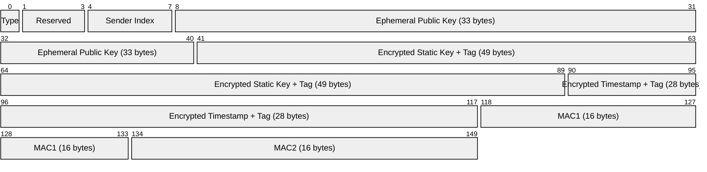
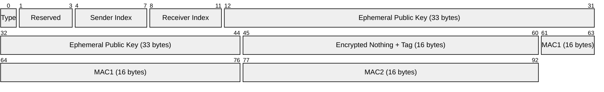
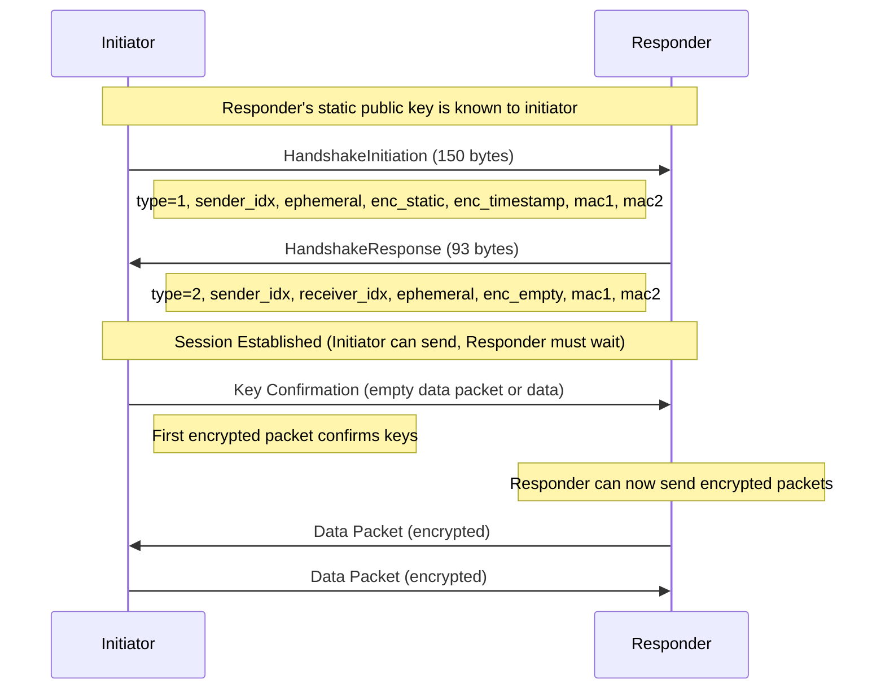
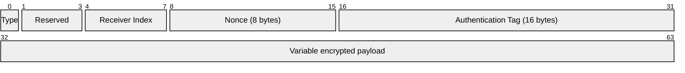
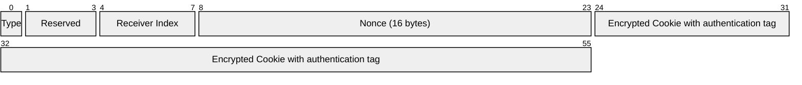
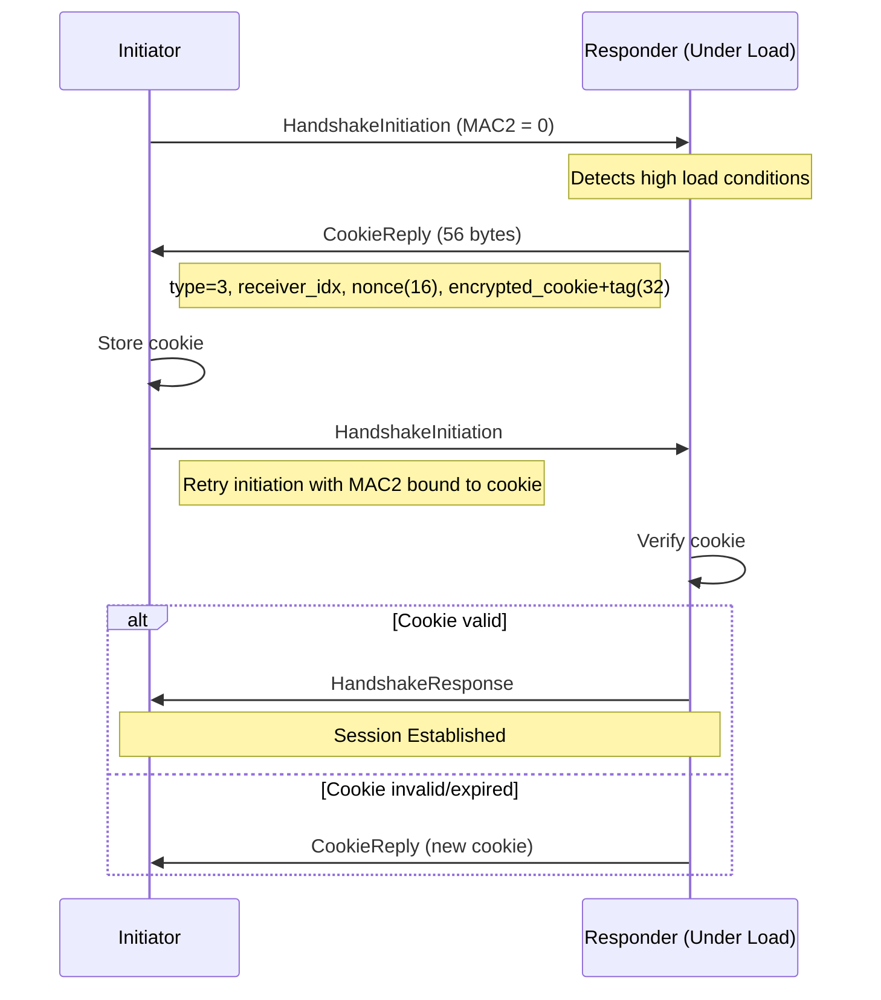
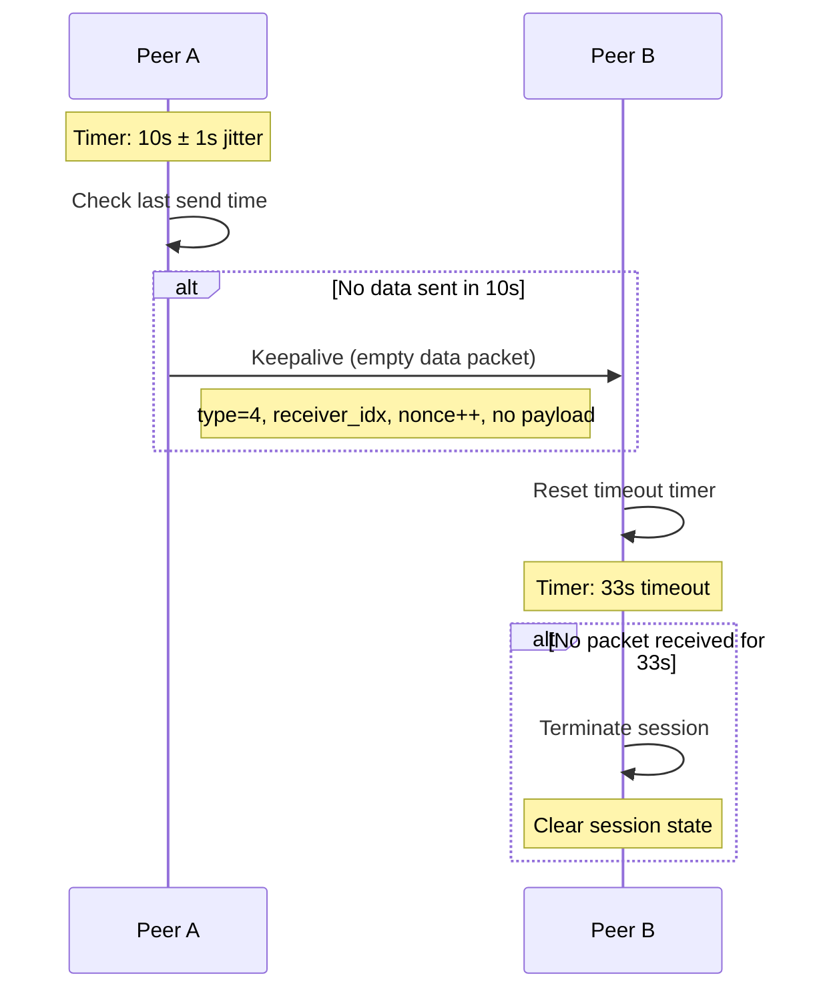
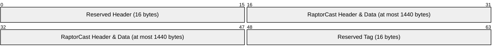

# Authenticated P2P Protocol for UDP

## Table of Contents

- [Authenticated P2P Protocol for UDP](#authenticated-p2p-protocol-for-udp)
  - [Table of Contents](#table-of-contents)
  - [Introduction](#introduction)
  - [Protocol](#protocol)
    - [Cryptography](#cryptography)
      - [Cryptographic Function Definitions](#cryptographic-function-definitions)
    - [Message Types and Flows](#message-types-and-flows)
    - [secp256k1 Key Format](#secp256k1-key-format)
      - [First Message: Initiator to Responder](#first-message-initiator-to-responder)
      - [Second Message: Responder to Initiator](#second-message-responder-to-initiator)
      - [Transport Data Keys](#transport-data-keys)
    - [Cookies](#cookies)
  - [Session Management](#session-management)
    - [Sessions](#sessions)
    - [Keepalive](#keepalive)
    - [Rekeying](#rekeying)
  - [Integration](#integration)
    - [RaptorCast integration](#raptorcast-integration)
    - [Discovery Integration](#discovery-integration)
    - [Upgrade Process](#upgrade-process)

## Introduction

This specification defines an authenticated peer-to-peer protocol for UDP-based communication. The protocol provides authenticity and integrity for UDP traffic, ensuring that packets come from verified peers and have not been tampered with. While encryption is not a hard requirement, the protocol includes it as the additional computational cost is negligible when using modern AEAD ciphers (specifically AEGIS128L).

The protocol addresses two primary concerns in the existing implementation.

The first concern is denial-of-service protection for RaptorCast communication. Current implementations require ECDSA signature verification for each packet, incurring approximately 20-30 microseconds of computational overhead per datagram. This creates a vulnerability where malicious actors can overwhelm validators with invalid signatures. By establishing authenticated sessions using symmetric AEAD operations, the protocol reduces per-datagram overhead to approximately 200 nanoseconds while providing authenticity, integrity, and encryption.

The second concern is traffic prioritization for transaction forwarding. The authentication flow guarantees that peers own their claimed IP addresses, enabling efficient prioritization based on either public key identity for known validators or IP address for general traffic. This allows network clients to implement quality-of-service policies that also prevent spam without computational overhead.

## Protocol

### Cryptography

The protocol follows the WireGuard design<sup>[4](#ref-4)</sup> with several modifications to cryptographic primitives. These changes enable integration with existing validator keys and achieve performance improvements.

The protocol uses secp256k1, allowing validators to use their existing validator keys as static keys in the Noise protocol. This eliminates the need for separate identity management since validators authenticate using the same keys they use for consensus participation.

AEGIS128L was selected based on performance measurements showing at least a 5x improvement over AES-GCM (approximately 200 nanoseconds versus 1 microsecond per packet) on processors with AES-NI extensions<sup>[5](#ref-5)</sup>.

The choice between BLAKE3 and SHA256 is less critical for protocol performance. BLAKE3 was selected for consistency since it is already used in other parts of the client. Key derivation uses BLAKE3's keyed hash mode for key derivation functions.

The protocol supports a 32-byte pre-shared key (PSK), which defaults to 32 zero bytes.

The Noise Protocol Framework<sup>[2](#ref-2)</sup> provides the handshake structure using the IK pattern with pre-shared key support. This pattern assumes the initiator knows the responder's static public key. The complete construction string is:

```
Noise_IKpsk2_secp256k1_AEGIS128L_BLAKE3
```

#### Cryptographic Function Definitions

Following the notation convention from the WireGuard whitepaper:

- hash(input): BLAKE3(input), returning 32 bytes of output
- mac(key, input): BLAKE3 in keyed mode, returning 16 bytes (first 16 bytes of the 32-byte output)
- keyed_hash(key, input): BLAKE3 in keyed mode with the specified key, returning 32 bytes
- aead_encrypt(key, nonce, plaintext, ad): AEGIS128L encryption with 16-byte key (when key derivation produces 32 bytes, use first 16 bytes), nonce (8 bytes zero-padded to 16 bytes, except for cookies which use 16-byte random nonce), plaintext, and associated data, returning ciphertext with 16-byte authentication tag appended
- aead_decrypt(key, nonce, ciphertext, ad): AEGIS128L decryption with 16-byte key (when key derivation produces 32 bytes, use first 16 bytes), nonce (8 bytes zero-padded to 16 bytes, except for cookies which use 16-byte random nonce), ciphertext (including tag), and associated data, returning plaintext or error
- generate_private_key(): Generate a random secp256k1 private key (32 bytes)
- derive_public_key(private_key): Derive the secp256k1 public key from a private key, returning 33 bytes in compressed format
- ecdh(private_key, public_key): Perform elliptic curve Diffie-Hellman on secp256k1, returning 32 bytes shared secret

All integers in the protocol are encoded in little-endian byte order, except for the TAI64N timestamp which uses big-endian encoding as per its specification<sup>[8](#ref-8)</sup>.

### Message Types and Flows

The protocol defines four message types for session establishment and data transfer:

```
TYPE_HANDSHAKE_INITIATION = 1
TYPE_HANDSHAKE_RESPONSE   = 2
TYPE_COOKIE_REPLY         = 3  
TYPE_DATA                 = 4
```

Handshake initiation packets contain 150 bytes:



Field descriptions:
- Type: Message type identifier (1 for initiation) used to distinguish packet types
- Reserved: Padding for alignment and future protocol extensions
- Sender Index: Random 4-byte identifier for this session used in response packets
- Ephemeral Public Key: Per-session ephemeral identity
- Encrypted Static Key: Encrypted initiator's long-term identity
- Encrypted Timestamp: TAI64N timestamp to prevent replay attacks across sessions
- MAC1: Authentication of entire packet using responder's public key hash
- MAC2: Cookie response MAC, empty unless under load (DoS protection)

Implementations must validate MAC fields before performing expensive operations such as ECDH, decryption, or state allocation. MAC1 is always verified first, and messages with invalid MAC1 are rejected. MAC2 must be verified before applying rate limiting, to prove ownership of the IP address (see Cookies section).

### secp256k1 Key Format

All secp256k1 public keys used in the protocol must be validated before processing:

1. Keys must be exactly 33 bytes in compressed form
2. The point must lie on the secp256k1 curve and must not be the point at infinity

Implementations must reject handshake attempts with invalid public keys.

Handshake response packets contain 93 bytes:



Field descriptions:
- Type: Message type identifier (2 for response) used to distinguish packet types
- Reserved: Padding for alignment and future protocol extensions
- Sender Index: Random 4-byte identifier for responder's session endpoint
- Receiver Index: Echo of initiator's sender index used to correlate response
- Ephemeral Public Key: Per-session ephemeral identity 
- Encrypted Nothing: Empty payload proves responder can derive shared secrets
- MAC1: Authentication of entire packet using initiator's static key hash
- MAC2: Cookie response MAC, empty unless under load (DoS protection)

Session establishment follows the NoiseIKpsk2 handshake pattern:



**Note:** After handshake completion, the responder cannot send encrypted packets until it receives the first encrypted packet from the initiator. The session is not considered complete from the responder's perspective until this confirmation is received. The initiator must send an empty encrypted packet immediately after session establishment if no data is queued, to enable bidirectional communication.

#### First Message: Initiator to Responder

The initiator creates a handshake initiation message:

```rust
const CONSTRUCTION: &[u8] = b"Noise_IKpsk2_secp256k1_AEGIS128L_BLAKE3";
const IDENTIFIER: &[u8] = b"authenticated udp v1 -- monad";
const LABEL_MAC1: &[u8] = b"mac1----";
const LABEL_COOKIE: &[u8] = b"cookie--";

initiator.chaining_key = hash(CONSTRUCTION);
initiator.hash = hash(&[
    &hash(&[&initiator.chaining_key, IDENTIFIER].concat()),
    &responder.static_public
].concat());

initiator.ephemeral_private = generate_private_key();

msg.message_type = 1;
msg.reserved_zero = [0, 0, 0];
msg.sender_index = rand::random::<u32>();

msg.unencrypted_ephemeral = derive_public_key(&initiator.ephemeral_private);
initiator.hash = hash(&[&initiator.hash, &msg.unencrypted_ephemeral].concat());

let temp = keyed_hash(&initiator.chaining_key, &msg.unencrypted_ephemeral);
initiator.chaining_key = keyed_hash(&temp, &[0x1]);

let temp = keyed_hash(&initiator.chaining_key, &ecdh(&initiator.ephemeral_private, &responder.static_public));
initiator.chaining_key = keyed_hash(&temp, &[0x1]);
let key = keyed_hash(&temp, &[&initiator.chaining_key, &[0x2]].concat());

msg.encrypted_static = aead_encrypt(&key, 0, &initiator.static_public, &initiator.hash);
initiator.hash = hash(&[&initiator.hash, &msg.encrypted_static].concat());

let temp = keyed_hash(&initiator.chaining_key, &ecdh(&initiator.static_private, &responder.static_public));
initiator.chaining_key = keyed_hash(&temp, &[0x1]);
let key = keyed_hash(&temp, &[&initiator.chaining_key, &[0x2]].concat());

msg.encrypted_timestamp = aead_encrypt(&key, 0, &tai64n(), &initiator.hash);
initiator.hash = hash(&[&initiator.hash, &msg.encrypted_timestamp].concat());

let mac_key = hash(&[LABEL_MAC1, &responder.static_public].concat());
msg.mac1 = mac(&mac_key, &msg.as_bytes()[..118]);

if let Some(cookie) = stored_cookie {
    let cookie_key = hash(&[LABEL_COOKIE, &responder.static_public].concat());
    let mac2_input = &[&msg.as_bytes()[..134], &cookie].concat();
    msg.mac2 = mac(&cookie_key, mac2_input);
} else {
    msg.mac2 = [0u8; 16];
}
```

#### Second Message: Responder to Initiator

The responder processes the initiation and creates a response:

```rust
responder.ephemeral_private = generate_private_key();

resp.message_type = 2;
resp.reserved_zero = [0, 0, 0];
resp.sender_index = rand::random::<u32>();
resp.receiver_index = sender_index;

resp.unencrypted_ephemeral = derive_public_key(&responder.ephemeral_private);
responder.hash = hash(&[&responder.hash, &resp.unencrypted_ephemeral].concat());

let temp = keyed_hash(&responder.chaining_key, &resp.unencrypted_ephemeral);
responder.chaining_key = keyed_hash(&temp, &[0x1]);

let temp = keyed_hash(&responder.chaining_key, &ecdh(&responder.ephemeral_private, unencrypted_ephemeral));
responder.chaining_key = keyed_hash(&temp, &[0x1]);

let temp = keyed_hash(&responder.chaining_key, &ecdh(&responder.ephemeral_private, &initiator_static));
responder.chaining_key = keyed_hash(&temp, &[0x1]);

let temp = keyed_hash(&responder.chaining_key, &preshared_key);
responder.chaining_key = keyed_hash(&temp, &[0x1]);
let temp2 = keyed_hash(&temp, &[&responder.chaining_key, &[0x2]].concat());
let key = keyed_hash(&temp, &[&temp2, &[0x3]].concat());
responder.hash = hash(&[&responder.hash, &temp2].concat());

resp.encrypted_nothing = aead_encrypt(&key, 0, &[], &responder.hash);
responder.hash = hash(&[&responder.hash, &resp.encrypted_nothing].concat());

let mac_key = hash(&[LABEL_MAC1, &initiator_static].concat());
resp.mac1 = mac(&mac_key, &resp.as_bytes()[..61]);

if let Some(cookie) = stored_cookie {
    let cookie_key = hash(&[LABEL_COOKIE, &initiator_static].concat());
    let mac2_input = &[&resp.as_bytes()[..77], &cookie].concat();
    resp.mac2 = mac(&cookie_key, mac2_input);
} else {
    resp.mac2 = [0u8; 16];
}
```

#### Transport Data Keys

After successful handshake, both parties have derived transport keys. The initiator's send_key equals the responder's recv_key, and vice versa, enabling bidirectional encrypted communication.

Data packets use a 32-byte header containing the message type, receiver index, nonce, and authentication tag:



Field descriptions:
- Type: Message type identifier (4 for data) used to distinguish from handshake packets
- Reserved: Padding for alignment and future protocol extensions
- Receiver Index: Session identifier from handshake that routes packet to correct session
- Nonce: 64-bit nonce for AEAD encryption that prevents replay within session
- Authentication Tag: 16-byte AEGIS128L authentication tag in header
- Encrypted Payload: Application data encrypted with session keys

After the handshake completes, both parties derive transport keys:

```rust
let temp1 = keyed_hash(&chaining_key, &[]);
let temp2 = keyed_hash(&temp1, &[0x01]);
let temp3 = keyed_hash(&temp1, &[&temp2, &[0x02]].concat());
let key1 = &temp2[..16];
let key2 = &temp3[..16];
```

The initiator keys are:

```rust
let send_key = key2;
let recv_key = key3;
```

The responder keys are:

```rust
let send_key = key3;
let recv_key = key2;
```


After transport keys have been derived, all temporary cryptographic materials must be zeroized:
- Ephemeral private keys (initiator.ephemeral_private, responder.ephemeral_private)
- KDF intermediate values (temp, temp2, and any other temporary key derivation materials)
- Decrypted cookies after validation
- Any other sensitive intermediate values used during the handshake

To send encrypted data:

```rust
let mut packet = DataPacket::new();
packet.message_type = 4;
packet.reserved_zero = [0, 0, 0];
packet.receiver_index = peer.receiver_index;
packet.nonce = sender.nonce;
sender.nonce += 1;

let encrypted_data = aead_encrypt(&sender.send_key, packet.nonce, &plaintext_data, &[]);
packet.encrypted_data = encrypted_data;
```

Nonces must never be reused. On the receiver side, replay protection should be implemented to account for possible packet reordering within a limited window. WireGuard sets this window to 2000 messages, requiring around 250 bytes per session using a bitmap. We can follow this approach and adjust if there is evidence of dropped packets.

When a session is closed (either due to timeout, explicit termination, or rekeying), all symmetric key material (send_key and recv_key) must be zeroized.

### Cookies

Under normal operation, the MAC2 field in handshake packets is set to zero and its validation can be skipped. When under load, a responder replies with a cookie instead of processing the handshake. The initiator must use this cookie to compute MAC2 field of a retransmitted handshake initiation. This mechanism ensures that attackers cannot overwhelm nodes with spoofed source addresses, as only legitimate initiators who receive the cookie response can complete the handshake.

Cookie reply packets contain 56 bytes:



Field descriptions:
- Type: Message type identifier (3 for cookie reply) used to distinguish packet types
- Reserved: Padding for alignment and future protocol extensions  
- Receiver Index: Echo of initiator's sender index from handshake initiation
- Nonce: 16-byte random nonce for AEAD encryption
- Encrypted Cookie: The encrypted cookie value with authentication tag



Upon receiving a valid CookieReply, the initiator must only store the cookie. Receipt of a CookieReply must not, by itself, trigger retransmission; retransmission of the handshake initiation with MAC2 is governed by the retransmission logic.

The cookie construction uses BLAKE3 keyed hashing with a secret that rotates every two minutes, limiting cookie validity while preventing replay attacks across rotation periods.

The cookie reply nonce is derived from a nonce secret obtained at startup and a monotonically increasing counter. This provides pseudorandom nonce generation without relying on system randomness for each cookie reply. When under load, the responder generates a cookie:

```rust
let cookie_secret = get_or_rotate_cookie_secret();
let cookie = mac(&cookie_secret, &initiator.ip_address);

let nonce_hash = keyed_hash(&nonce_secret, &nonce_counter.to_le_bytes());
let nonce = &nonce_hash[..16];
nonce_counter += 1;

let mut reply = CookieReply::new();
reply.message_type = 3;
reply.reserved = [0, 0, 0];
reply.receiver_index = msg.sender_index;
reply.nonce = nonce;

let temp_key = hash(&[LABEL_COOKIE, &responder.static_public].concat());
reply.cookie_encrypted = aead_encrypt(&temp_key, &reply.nonce, &cookie, &msg.mac1);
```

When receiving a handshake initiation with MAC2:

```rust
if msg.mac2 != [0u8; 16] {
    let cookie_secret = get_cookie_secret();
    let expected_cookie = mac(&cookie_secret, &initiator.ip_address);
    
    let temp_key = hash(&[LABEL_COOKIE, &responder.static_public].concat());
    let mac2_input = &[&msg.as_bytes()[..134], &expected_cookie].concat();
    let expected_mac2 = mac(&temp_key, mac2_input);
    
    if msg.mac2 != expected_mac2 {
        return Err("Invalid cookie");
    }
}
```

Note that responder and initiator in the context of cookie replies are unrelated to handshake initiation. The initiator sends the message, and the responder replies to it.
The initiator IP address is the message source IP address (without port). The responder's static public key is always the local static public key.

## Session Management

### Sessions

The protocol supports two distinct session use cases: long-term sessions for known validator identities, which maintain persistent connections through active keepalive and automatic re-establishment after failures.

Short-lived sessions serve connections with full nodes, which may connect transiently for transaction submission or other queries. Full nodes do not send keepalive packets, allowing these sessions to naturally expire after the timeout period. The implementation will provide an API to establish sessions before sending actual traffic to avoid delays.

Each session requires approximately 512B of memory for nonce replay prevention windows and connection state. With this footprint, nodes can support up to 100,000 concurrent sessions.

### Keepalive

Keepalive maintains session liveness through zero-length data packets:



With a 10-second keepalive interval and 1-second random jitter, sessions terminate after 33 seconds without receiving any packet, accounting for network delays and jitter.

### Rekeying

Forward secrecy is not a goal of this protocol. However, periodic rekeying provides post-compromise security, protecting against scenarios such as accidental nonce reuse due to implementation bugs or other key material compromise.

The protocol implements periodic rekeying with REKEY_AFTER_TIMEOUT set to 6 hours. After 6 hours from session establishment, the original initiator starts a new handshake initiation. The responder recognizes this as a rekeying attempt by checking the timestamp of the existing established session with the same peer. During rekeying, the responder must not apply the global rate limit to handshake packets from peers with existing sessions.

The rekeying process follows the standard session establishment protocol. Once the new session is established and confirmed (after the initiator sends the first encrypted packet), both participants are free to drop the original session from memory. During the transition period, implementations should accept packets on both the old and new sessions to ensure seamless rekeying without packet loss.

Regarding nonce exhaustion: with a 64-bit nonce providing 2^64 unique values, this is not a practical concern. At 1 Gbps throughput with 1500-byte packets, the maximum packet rate is approximately 83,000 packets per second. With a 64-bit nonce space providing approximately 1.8e19 unique values, nonce exhaustion would occur after 2.2e14 seconds, or approximately 7 million years. Even at theoretical 10 Gbps rates with minimal 64-byte packets, exhaustion would take over 30,000 years.

## Integration

### RaptorCast integration

RaptorCast integration reserves 32 bytes in each datagram for header and AEAD encryption.



**Note:** The actual RaptorCast packet data is variable-sized. The diagram shows the full 1440-byte allocation, individual packets may be smaller.

This reservation applies to all upgraded nodes, regardless of whether specific peers support authentication. When communicating with legacy nodes, the sender uses only 1440 bytes of payload in plaintext, ensuring compatibility. When both peers support authentication, the full 1472-byte packet carries encrypted data.

### Discovery Integration

The peer discovery service advertises authentication capability through a new flag<sup>[6](#ref-6)</sup>:

```
AUTHENTICATED_RAPTORCAST = 1 << 2
```

Nodes include this capability in their MonadNameRecord along with the port number for authenticated connections, allowing peers to identify authentication support and connection details before attempting handshakes.

Authenticated traffic uses a separate UDP socket on port 30304 (subject to change), isolating the authentication state machine from legacy traffic. This separation prevents interference between encrypted and unencrypted flows. Nodes advertise this port number in their discovery records to ensure peers can establish authenticated sessions.

### Upgrade Process

RaptorCast leaders determine chunk sizes based on their authentication support. Legacy leaders create 1472-byte chunks transmitted as plaintext by all nodes. Upgraded leaders create 1440-byte chunks with 32-byte reservation, allowing encrypted transmission to capable peers.

The decision flow for each outgoing packet:

```
if peer.has_capability(AUTHENTICATED_RAPTORCAST) AND session_established(peer):
    send_encrypted(data, full_1472_bytes)
else:
    send_plaintext(data, reduced_1440_bytes)
```
Subsequent peers forward traffic through the encrypted port only if it was received on the encrypted port as well. This guarantees that encryption will be enabled gradually, without interrupting normal operations.

---

<a id="ref-1"></a>
1. AEGIS AEAD specification: https://datatracker.ietf.org/doc/draft-irtf-cfrg-aegis-aead/

<a id="ref-2"></a>
2. Noise Protocol Framework: http://www.noiseprotocol.org/

<a id="ref-3"></a>
3. Lightning Network Transport (BOLT #8): https://github.com/lightning/bolts/blob/master/08-transport.md

<a id="ref-4"></a>
4. WireGuard Protocol: https://www.wireguard.com/protocol/

<a id="ref-5"></a>
5. AEGIS Benchmarks: https://github.com/jedisct1/rust-aegis?tab=readme-ov-file#benchmarks

<a id="ref-6"></a>
6. monad-discovery: future proof name record structure: https://github.com/category-labs/monad-bft/pull/2042

<a id="ref-7"></a>
7. BLAKE3 Specification: https://www.ietf.org/archive/id/draft-aumasson-blake3-00.html#section-1.1

<a id="ref-8"></a>
8. TAI64N Specification: https://cr.yp.to/libtai/tai64.html
